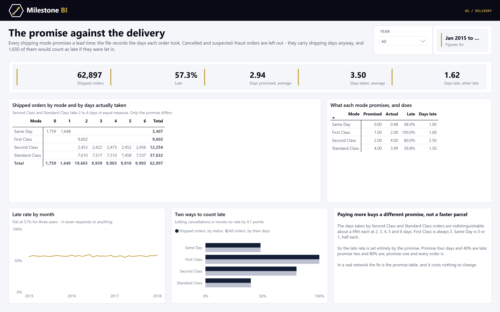

# Supply chain delivery - a Power BI model you can review

Three years of a sports and outdoor retailer's orders - 180,519 order lines on 65,752 orders,
January 2015 to January 2018, shipped to 164 countries - rebuilt as a Power BI star schema:
net sales and margin, cancellations, and delivery performance against the lead time each
shipping mode promises.

The whole project is text. The semantic model is TMDL, the report is PBIR, and both are generated
by the Python in `etl/`, so every measure, relationship and visual can be read and diffed in a
pull request.



## What it finds

- **First Class is late on every order.** It promises one day and takes two - all 9,602 shipped
  First Class orders. Across all modes, 57% of shipped orders arrive late.
- **Second Class and Standard Class deliver identically.** Both take 2 to 6 days in equal
  proportions. Second Class promises two days and is late 80% of the time; Standard promises four
  and is late 40%. The late rate is set by the promise, not the network.
- **The column called Sales is not revenue.** It is price x quantity before discount, on every
  order including the cancelled ones. Summed, it overstates net sales on shipped orders by 16%.

## What the source gets wrong, and what the model does about it

| Problem | Evidence | Decision |
|---|---|---|
| Revenue sits in a column not called Sales | `Sales` = price x quantity; `Order Item Total` = Sales less discount | Net Sales measure on `Order Item Total`, shipped orders only; the gross figure kept beside it |
| Misnamed columns | `Order Profit Per Order` is per line; `Benefit per order` and `Sales per customer` are exact copies of other columns | Duplicates dropped, names corrected in the model |
| The late flag is a status | `Late_delivery_risk` is 1 exactly when Delivery Status is "Late delivery"; 1,650 cancelled orders are late by their own dates but never flagged | Delivery measures use the status and exclude cancellations; the naive day-based rate is shown for comparison |
| The last four months are a different generator | From 3 October 2017: one line per order (was 1-5), 68-69 orders a day, 100 of 101 products replaced by 17 new ones | Flagged on the date table as a separate series; shown on its own page |
| Market is a calendar | In 26 of 37 months every order goes to a single market | Shown as a chart; no market comparison is built on it |
| Payment type decides order status | Cash is always Closed; every suspected fraud is a bank transfer | Recorded; no fraud pattern read into it |
| Countries in Spanish | "Estados Unidos", "Alemania", "Reino Unido" | Translated in `etl/country_names.py`; the build fails on an unknown name |
| Discount rate disagrees with discount amount | 10,029 lines differ by up to $10 | Measures use the amounts, which reconcile to the line total |
| Stray whitespace | "South of  USA ", "Health and Beauty " | Trimmed and collapsed |
| Placeholder customers | 65,150 lines are "Mary", 64,104 "Smith"; email and password masked | Names, addresses, zip codes and coordinates dropped; segment and store kept |

The profit column is flat - about 19% of lines lose money whatever the discount, department,
mode or market - so the report shows where profit is and does not claim to explain the losses.

## Model

| Table | Grain | Rows |
|---|---|---|
| `Order Lines` | order line, one partition per year | 180,519 |
| `Date` | day, marked date table, with the series flag | 1,127 |
| `Product` | product, with the catalogue it belongs to | 118 |
| `Customer` | customer: segment and store only | 20,652 |
| `Geography` | market, region, country (English) | 167 |
| `Shipping Mode` | mode and promised days | 4 |
| `Outcome` | payment type x order status x delivery status | 23 |

Order-level fields repeat on every line of an order; the ETL proves they never vary within one,
so order measures are distinct counts off the line fact and averages are taken per order, not
per line.

## Build

```
python etl/build_star_schema.py --source <folder holding DataCoSupplyChainDataset.csv>
python etl/build_model.py            # TMDL - partitions read data/ from this repo on GitHub
python etl/build_report.py           # PBIR
powershell -File etl/check_tmdl.ps1  # parse the TMDL with Desktop's own serializer
```

The 96 MB source is not committed. Download `DataCoSupplyChainDataset.csv` from the Mendeley
Data page below; the build checks its SHA-256 against the published file before reading it.
`etl/verify_measures.py` recomputes ten measures in pandas by year, shipping mode, market and
department and diffs them against the live model.

## Source and licence

Constante, Fabian; Silva, Fernando; Pereira, António (2019), "DataCo SMART SUPPLY CHAIN FOR BIG
DATA ANALYSIS", Mendeley Data, V5, [doi:10.17632/8gx2fvg2k6.5](https://doi.org/10.17632/8gx2fvg2k6.5),
licensed [CC BY 4.0](https://creativecommons.org/licenses/by/4.0/). The CSVs in `data/` are
derived from it: columns dropped, whitespace trimmed, countries translated and the table split
into a star schema. Code: see `LICENSE`.

Built by [Milestone BI](https://milestonebi.com/supply-chain/).
